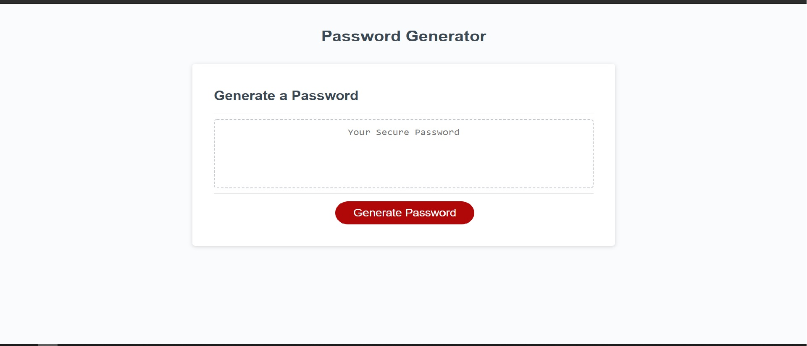

# Random Number Generator Project

## Table of contents
* [Aim](#Aim)
* [Prerequisites](#Prerequisites)
* [Pictures](#Pictures)

# General info :

## Built With:

* HTML
* Css
* reset.css (Link in recources)
* Visual Studio Code

## Aim :

This project was Bootcamp Challenge to design the javascipt element of the program, all Javascript was written by me
Html and css were part of the bootcamps own design. 

## Prerequisites :

Can be opened in any text editor workspace

## Example
* Visual studio code
* notepad++

## Pictures :

